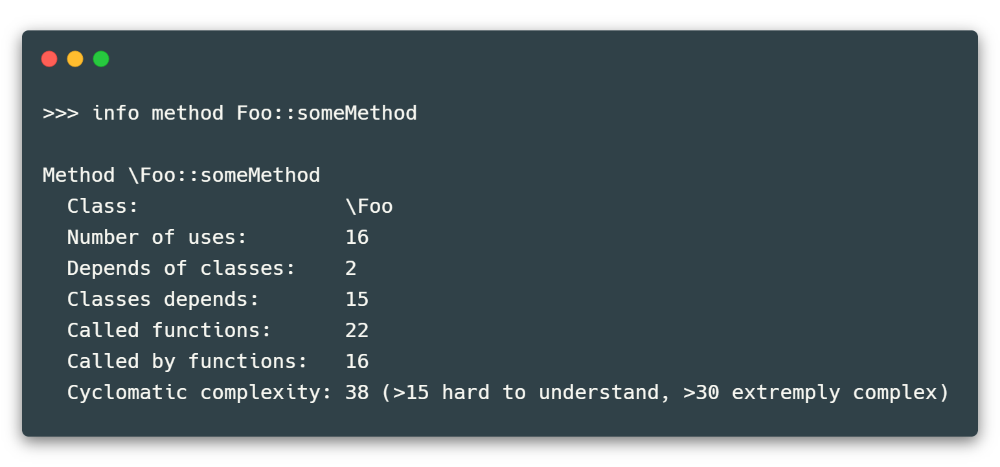
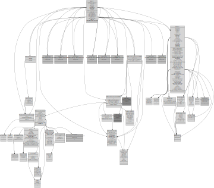
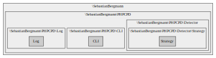
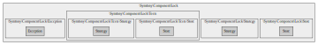

# phpstats

`phpstats` is a utility for collecting project statistics and building dependency graphs for PHP, that allows you to find places in the code that can be improved.

It tries to be fast, ~150k LOC/s (lines of code per second) on Core i5 with SSD with ~3500Mb/s for reading.

This tool is written in [Go](https://golang.org/) and uses [NoVerify](https://github.com/VKCOM/noverify).



## What's currently available?

### Metrics

1. `Afferent couplings`:

   - for classes;
   - for namespaces;

2. `Efferent couplings`:
   - for classes;
   - for namespaces;
   
3. `Instability`:
   - for the classes;
   - for namespaces;
   
4. `Lack of Cohesion in Methods`;
5. `Lack of Cohesion in Methods 4`;
6. `Cyclomatic Complexity`.

### Graph output (Graphviz format)

1. File dependencies, both for root and inside functions.

   ```
   graph file -o file.gv SomeFile.php
   ```

2. Class dependencies.

   ```
   graph class -o file.gv Symfony\Component\Routing\Router
   ```

  

3. Function/method dependencies.

   ```
   graph func -o file.gv \Symfony\Component\Routing\Route::setDefaults
   ```

  

4. All project namespaces

   ```
   graph namespaces -o file.gv
   ```

  

5. Specific namespace

   ```
   graph namespace -o file.gv Symfony\Component\Lock
   ```

  

7. LCOM4

   ```
   graph lcom4 -o file.gv SomeClass
   ```

### Tops

#### Classes

- top classes by Lack of cohesion in methods
- top classes by Lack of cohesion in methods 4
- top classes by dependencies
- top classes by afferent coupling
- top classes by efferent coupling
- top classes by instability
- top classes by as dependency

#### Functions

- top functions by dependencies
- top functions by as dependency
- top functions by uses count
- top functions by cyclomatic complexity

## Install

```
go get github.com/i582/phpstats
```

## Usage

```
collect [--port <value>] [--project-path <dir>] [--cache-dir <dir>] <analyze-dir>
```

The `--project-path` flag sets the directory relative to which paths to files will be resolved when importing. If the flag is not set, the directory is set to the value of the current analyzed directory.

The `--cache-dir` flag sets a custom cache directory.

The `--port` flag sets the port for the server. See the [server](#Server) part.

After collecting information, you will be taken to an interactive shell, type `help` for help.

```
 >>> help

Commands:
  brief                               shows general information
  
  info                                info about
     func (or method) <value>         info about function or method

     file  <value>                    info about file
       [-f]                           output full information

     namespace  <value>               info about namespace

     class (or interface) <value>     info about class or interface
  
  graph                               dependencies graph view
     file  <value>                    dependency graph for file
        -o <value>                    output file
       [-r <value>]                   recursive level (default: 5)
       [-root]                        only root require
       [-block]                       only block require
       [-show]                        show graph file in console

     class (or interface) <value>     dependency graph for class or interface
       [-show]                        show graph file in console
        -o <value>                    output file
       [-r <value>]                   recursive level (default: 5)

     func (or method) <value>         dependency graph for function or method
        -o <value>                    output file
       [-show]                        show graph file in console

     lcom4  <value>                   show lcom4 connected class components
        -o <value>                    output file
       [-show]                        show graph file in console

     namespaces                       show graph with all namespaces
        -o <value>                    output file
       [-show]                        show graph file in console

     namespace  <value>               show graph with namespace
        -o <value>                    output file
       [-show]                        show graph file in console

  top                                 shows top of
     funcs                            show top of functions
       [-c <value>]                   count in list (default: 10)
       [-o <value>]                   offset in list (default: 0)
       [-by-deps]                     top functions by dependencies
       [-by-as-dep]                   top functions by as dependency
       [-by-uses]                     top functions by uses count
       [-by-сс]                       top functions by cyclomatic complexity
       [-r]                           sort reverse

     classes                          show top of classes
       [-by-lcom]                     top classes by Lack of cohesion in methods
       [-by-lcom4]                    top classes by Lack of cohesion in methods 4
       [-by-deps]                     top classes by dependencies
       [-r]                           sort reverse
       [-by-aff]                      top classes by afferent coupling
       [-by-instab]                   top classes by instability
       [-by-as-dep]                   top classes by as dependency
       [-c <value>]                   count in list (default: 10)
       [-o <value>]                   offset in list (default: 0)
       [-by-eff]                      top classes by efferent coupling

  list                                list of
     funcs                            show list of functions
       [-c <value>]                   count in list (default: 10)
       [-o <value>]                   offset in list (default: 0)
       [-e]                           show embedded functions

     methods                          show list of methods
       [-c <value>]                   count in list (default: 10)
       [-o <value>]                   offset in list (default: 0)

     files                            show list of files
       [-c <value>]                   count in list (default: 10)
       [-o <value>]                   offset in list (default: 0)
       [-f]                           show full information

     classes                          show list of classes
       [-c <value>]                   count in list (default: 10)
       [-o <value>]                   offset in list (default: 0)

     interfaces                       show list of interfaces
       [-c <value>]                   count in list (default: 10)
       [-o <value>]                   offset in list (default: 0)
       [-f]                           show full information

     namespaces                       show list of namespaces on specific level
       [-c <value>]                   count in list (default: 10)
       [-o <value>]                   offset in list (default: 0)
       [-l <value>]                   level of namespaces (default: 0)
       [-f]                           show full information
  
  help                                help page
  clear                               clear screen
  exit                                exit the program
  
>>>
```

## Server

> Server and API are under development.

A local server (port 8080) is used to interact with the analyzer from other programs. The server, by default, is started every time an analysis is started.

### API

`/info/class?name=value` — getting information about the class by its name (the name does not have to be completely the same, the search is not strict).

`/info/func?name=value` — getting information about a function by its name.

`/info/namespace?name=value` — getting information about a namespace by its name.

`/exit` — shutdown of the server.

`/analyzeStats` — get the current analysis state.

## License

MIT

---

Code with ❤