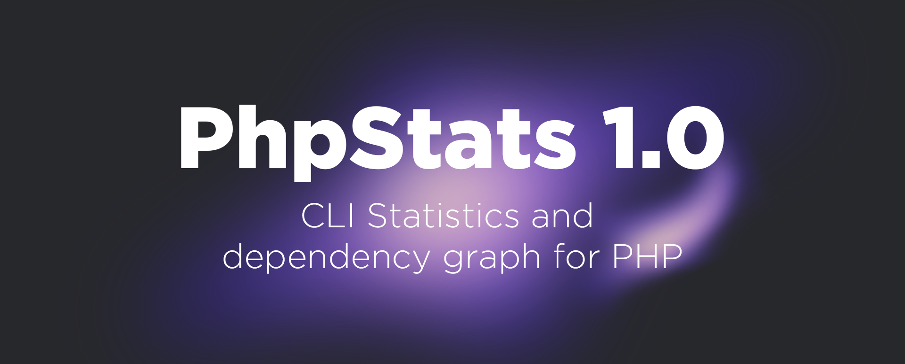

[](https://goreportcard.com/report/github.com/i582/phpstats) [](https://raw.githubusercontent.com/i582/phpstats/master/LICENSE) 

# phpstats

`phpstats` is a utility for collecting project statistics and building dependency graphs for PHP, that allows you to find places in the code that can be improved.

It tries to be fast, ~150k LOC/s (lines of code per second) on Core i5 with SSD with ~3500Mb/s for reading.

This tool is written in [Go](https://golang.org/) and uses [NoVerify](https://github.com/VKCOM/noverify).

## Table of Contents

* [What is currently available?](#what-is-currently-available)
* [Install](#install)
* [Usage](#usage)
* [Server](#server)
* [Contact](#contact)
* [Contributing](#contributing)
* [License](#license)


## What is currently available?

### Metrics

1. `Afferent couplings`:
   - for classes;
   - for namespaces;
2. `Efferent couplings`:
   - for classes;
   - for namespaces;
3. `Instability`:
   - for the classes;
   - for namespaces;
4. `Lack of Cohesion in Methods`;
5. `Lack of Cohesion in Methods 4`;
6. `Cyclomatic Complexity`;
7. `Count of magic numbers in functions and methods`.

### Graph output (Graphviz format and svg)

1. File dependencies, both root and included inside functions;

2. Class dependencies;


3. Function/method dependencies;


4. All project namespaces;


5. Specific namespace and its child namespaces;


7. LCOM4.

See [examples of graphs.](doc/graphs.md)

### Tops

#### Classes

- by Lack of cohesion in methods;
- by Lack of cohesion in methods 4;
- by Afferent coupling;
- by Efferent coupling;
- by Instability;
- by the number of classes on which it depends;
- by the number of classes dependent on it.

#### Functions

- by  the number of classes on which it depends;
- by the number of classes dependent on it;
- by uses count;
- by cyclomatic complexity;
- by count of magic numbers.

### Brief project information

- Count of classes;
- Count of methods;
- Count of constants;
- Count of functions;
- Count of files;
- Count of lines of code.

## Install

If you don't have the Go toolkit installed, then go to the official [site](https://golang.org/) and install it to continue.

After installation, run the following command in terminal.

```
go get -u -v github.com/i582/phpstats
```

After that you can use it by writing `~/go/bin/phpstats` in the terminal.

If you want to work with dependency graphs, then you need to install the [Graphviz](https://graphviz.org/download/) utility to visualize graphs.

## Usage

```
$ phpstats collect [--port <value>] [--project-path <dir>] [--cache-dir <dir>] <analyze-dir>
```

The `--project-path` flag sets the directory relative to which paths to files will be resolved when importing. If the flag is not set, the directory is set to the value of the current analyzed directory.

The `--cache-dir` flag sets a custom cache directory.

The `--port` flag sets the port for the server. See the [server](#Server) part.

After collecting information you will be taken to an interactive shell, for help, enter `help`.

### Metrics

To view the metrics, use the `info` command, which shows information about classes, functions and files by their names. The search is not strict, so it is not necessary to enter the full name.

```
>>> info class ClassName
# show information about ClassName class.
```

For command information, write `info help`.

### Graph output (Graphviz format and svg)

To build graphs, use the `graph` command. The `-o` flag is required and sets the file in which the graph will be placed.

```
>>> graph class -o graph.svg ClassName
# outputs the graph for the ClassName class dependencies to the graph.svg file.
```

When creating a graph, two files are created, one with the source code of the graph in the `graphviz` format and a file with the graph in `svg` format.

For command information, write `graph help`.

### Tops

Tops displays information about the top functions, classes and files. The `top` command is used to display the top.

```
>>> top classes
# shows the top 10 classes.
```

To show the list in reverse, add the file `-r`. To control the count and offset in the list, use the `-c` and `-o` flags, respectively.

```
>>> top classes -c 100 -o 10 -r
# shows the top 100 classes from the end, starting from the 10th.
```

Supported output to a file in `json` format, for this add the `--output` flag and the path to the file to which you want to write the list.

```
>>> top classes --output top-classes.json
# outputs the top 10 classes to the top-classes.json file.
```

For command information, write `top help`.

### Brief project information

Use the `brief` command to show brief information about the project.

```
>>> brief
# shows brief information.
```

### Brief metrics information

Use the `metrics` command to see a summary of the metrics being collected.

```
>>> metrics
# shows brief information about of the colected metrics.
```

## Server

> Server and API are under development.

A local server (port 8080 by default) is used to interact with the analyzer from other programs. The server, by default, is started every time an analysis is started.

### API

> All API responses are in `json` format.

`/info/class?name=value` — getting information about the class by its name (the name does not have to be completely the same, the search is not strict).

`/info/func?name=value` — getting information about a function by its name.

`/info/namespace?name=value` — getting information about a namespace by its name.

`/exit` — shutdown of the server.

`/analyzeStats` — getting the current analysis state.

## Contact

 For any questions — tg: `@petr_makhnev`.

## Contributing

Feel free to contribute to this project. I am always glad to new people.

## License

This project is under the MIT License. See the [LICENSE](https://github.com/i582/phpstats/blob/master/LICENSE) file for the full license text.
