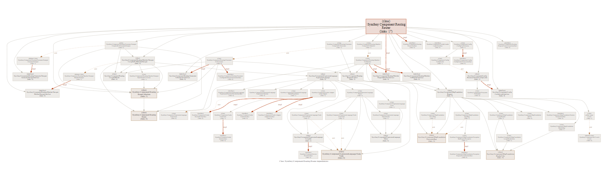
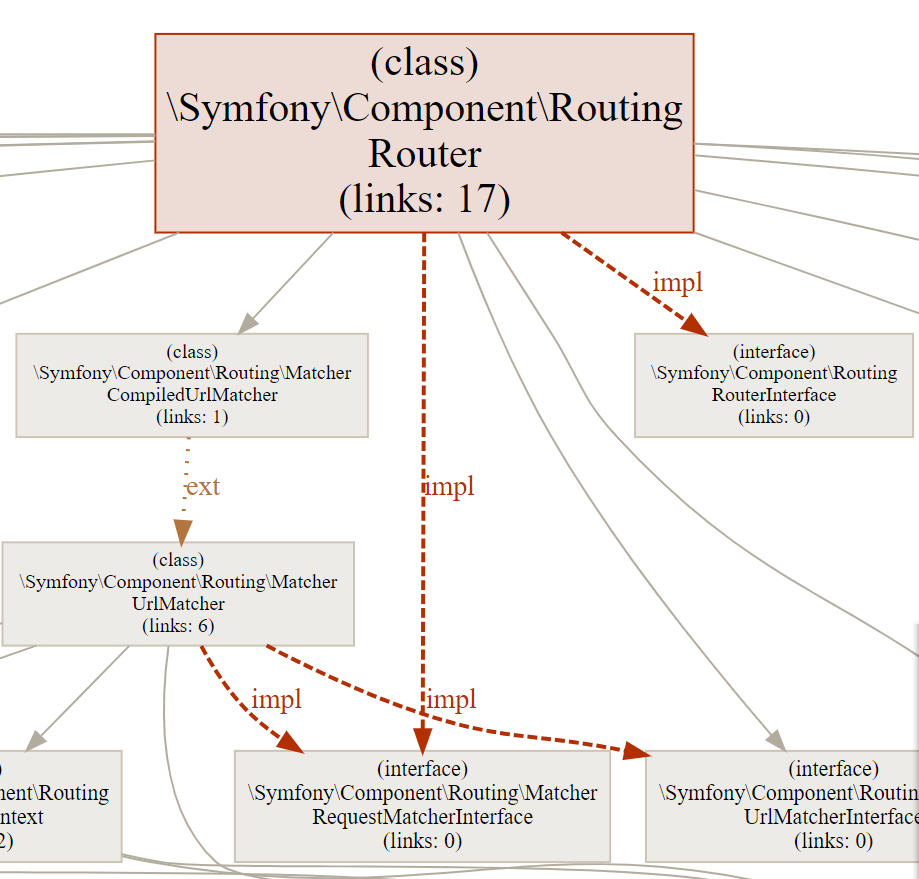
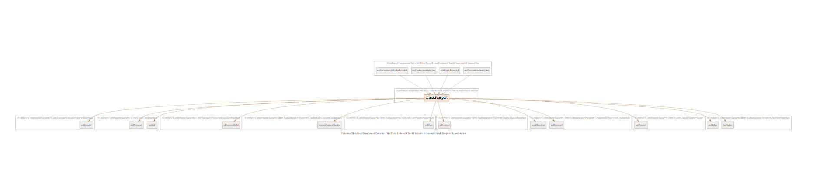
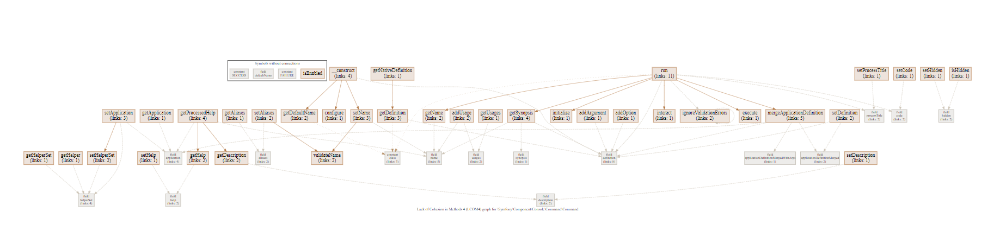
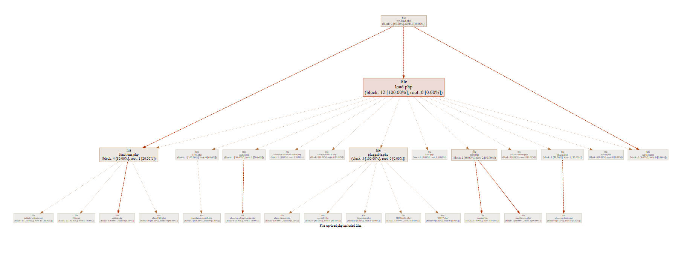
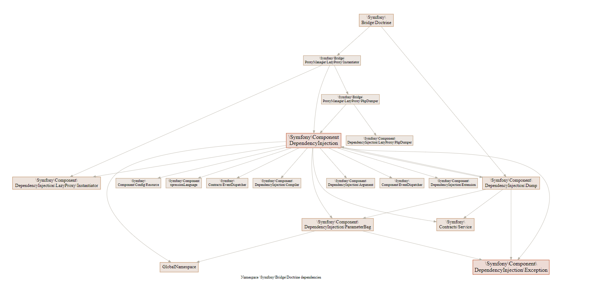
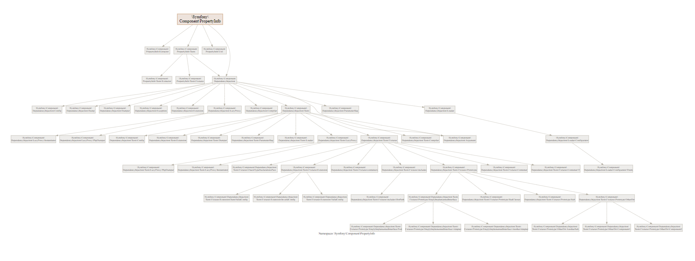

# Building graphs

**phpstats** allows you to create various graphs that display certain relationships in the code.

There are two ways to output, directly to `svg` and in the browser. The first option (default) is perfect if you need to **save and send** the graph to someone, the second (see flag `--web`) is ideal for **immediate viewing**. When displayed in a browser, the resulting graph **can be moved, as well as its scale**, using the mouse wheel. To try it, download one of the graphs below and open it in a separate browser tab (unfortunately, if you open the graph from `github`, then nothing will work, since `github` prohibits the use of internal scripts, which are necessary for interactive work). 

To create a graph in the internal interactive shell, use the `graph` command, which accepts another command that determines the type of the graph. Description and examples of commands below.

## Table of Contents

* [Class (or interface) dependencies](#class-or-interface-dependencies)
* [Class (interface) extend and implementation dependencies](#class-interface-extend-and-implementation-dependencies)
* [Function or method dependencies](#function-or-method-dependencies)
* [Links within a class (or graph for the LCOM 4 metric)](#links-within-a-class-or-graph-for-the-lcom-4-metric)
* [Links between files](#links-between-files)
* [Namespace dependencies graph](#namespace-dependencies-graph)
* [Namespace structure graph](#namespace-structure-graph)

### Class (or interface) dependencies

Example ([svg](./class_deps_graph.svg)):


Includes the usual relationships between classes, as well as separate extend and implementation relationships.


To build a graph, use the `graph class` command.

The command takes one argument, the **name of the class**.

The command can also accept flags:

1. `-o` — name of the file to which the graph will be saved;
2. `-r` — the level of nesting that is required (value 0 displays only the closest dependencies, 1 — also displays all the closest dependencies for the closest dependencies, and so on);
3. `--inheritance` — flag, when set, the graph will be displayed only with extends or implementation links, see the graph below;
4. `--web` — flag, when set, the graph will be displayed in the browser with the ability to move and scale the graph.

#### Examples

For example, to create the graph above, the following command was used:

```
graph class -o graph.svg \Symfony\Component\Routing\Router
```

And for the graph below:

```
graph class -o graph.svg --inheritance \Symfony\Component\Routing\Router
```

### Class (interface) extend and implementation dependencies

Example ([svg](./inhiritance_graph.svg)):


Contains only extend and implementation links.

To get the graph, use the same command as for the graph above. See the last example.

### Function or method dependencies

Example ([svg](./function_graph.svg)):


Contains the functions to be called as well as the fields used. For convenience, fields and methods are combined into named groups for each class.

To get the graph, use the `graph func` command.

The command takes one argument, the **name of the function**.

The command can also accept flags:

1. `-o` — name of the file to which the graph will be saved;
2. `--web` — flag, when set, the graph will be displayed in the browser with the ability to move and scale the graph.

#### Example

For example, to create the graph above, the following command was used:

```
graph func -o graph.svg \Symfony\Component\Routing\Route::setDefaults
```

### Links within a class (or graph for the LCOM 4 metric)

Example ([svg](./class_lcom4_graph.svg)):


Contains links within the class. Elements that are not used anywhere are highlighted in a separate group.

To get the graph, use the command `graph lcom4`.

The command takes one argument, the **name of the class**.

The command can also accept flags:

1. `-o` — name of the file to which the graph will be saved;
2. `--web` — flag, when set, the graph will be displayed in the browser with the ability to move and scale the graph.

#### Example

For example, to create the graph above, the following command was used:

```
graph lcom4 -o graph.svg \Symfony\Component\Console\Command\Command
```

## Links between files

Example ([svg](./file_graph.svg)):



Contains links between files, through inclusion in the global space and at the function level. Block connections are marked with dotted lines, global ones — with dashed.

To get a graph, use the `graph file` command.

The command takes one argument, the **name of the file**.

The command can also accept flags:

1. `-o` — name of the file to which the graph will be saved;
2. `-r` — the level of nesting that is required (value 0 displays only the closest dependencies, 1 — also displays all the closest dependencies for the closest dependencies, and so on);
3. `--root` — display in the graph links with files included in the global space;
2. `--block` — display in the graph links with files included in functions;
5. `--web` — flag, when set, the graph will be displayed in the browser with the ability to move and scale the graph.

If none of the flags (`--root`, `--block`) is specified, then by default all links will be displayed.

#### Example

For example, to create the graph above, the following command was used:

```
graph file -o graph.svg wp-load.php
```

## Namespace dependencies graph

Example ([svg](./namespace_deps_graph.svg)):



Contains links between namespaces.

To get a graph, use the `graph namespace` command.

The command takes one argument, the **name of the namespace**.

The command can also accept flags:

1. `-o` — name of the file to which the graph will be saved;
2. `-r` — the level of nesting that is required (value 0 displays only the closest children, 1 — also displays all the closest children for the closest children, and so on);
3. `--web` — flag, when set, the graph will be displayed in the browser with the ability to move and scale the graph.

#### Example

For example, to create the graph above, the following command was used:

```
graph namespace --web \Symfony\Bridge\Doctrine -r 2
```

## Namespace structure graph

Example ([svg](./namespace_graph.svg)):



Contains the relationships between namespaces and their child namespaces.

To get a graph, use the `graph namespace-structure` command.

The command takes one argument, the **name of the namespace**.

The command can also accept flags:

1. `-o` — name of the file to which the graph will be saved;
2. `-r` — the level of nesting that is required (value 0 displays only the closest children, 1 — also displays all the closest children for the closest children, and so on);
3. `--web` — flag, when set, the graph will be displayed in the browser with the ability to move and scale the graph.

#### Example

For example, to create the graph above, the following command was used:

```
graph namespace-structure --web \Symfony\Component\PropertyInfo
```

[Next (Relationships between symbols) →](./relation.md)