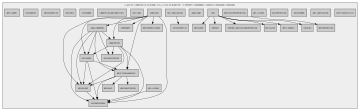

# Examples of graphs

1. Class dependencies:

   
   
2. Function/method dependencies:

   
   
3. All project namespaces:

   
   
4. Specific namespace and its child namespaces:

   
   
5. LCOM4:

   
